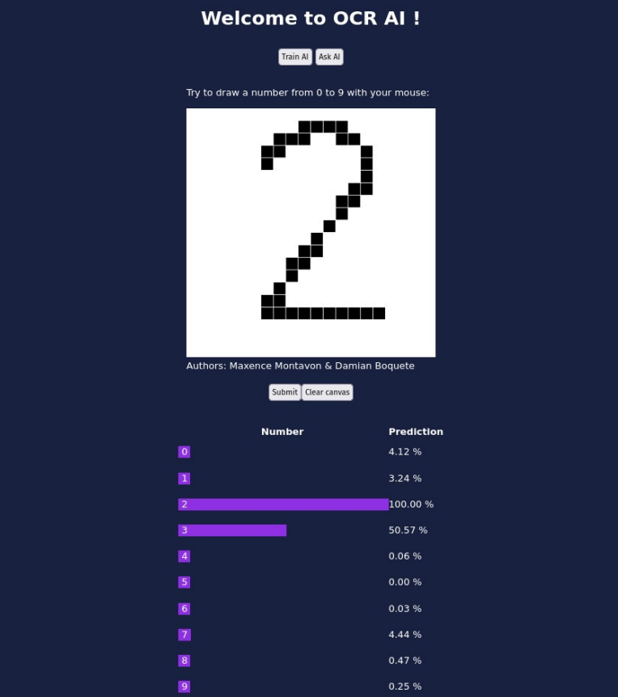

# Optical Character Recognition (OCR) app

**authors**: Maxence Montavon & Damian Boquete Costa

**Last modification**: 20.06.2022

---

<p align="center">
  
</p>

### Description
This work implements, with Keras and Python, a Convolutional Neural Network trained on MNIST dataset to recognise handwritten digits.

This AI is then used in a simple Web App made with JavaScript & the good ol' HTML5/CSS3 duo.

This work is based on 2 documents:
- [`labo.pdf`](labo.pdf): assignment rules.
- [`neural_network.pdf`](neural_network.pdf): Excellent course from Adrien Lescourt & Tarik Garidi.

[`presentation_OCR.pdf`](presentation_OCR.pdf) is a simple presentation available (only in french) that describes this work with more details.  

### How to use the program
#### Create a virtual environment & install dependencies
```console
python3 -m venv .venv
source .venv/bin/activate
pip install -r requirements.txt
```

#### Execute
```console
source .venv/bin/activate
cd backend/
uvicorn app:app --reload
```

---

### Sources
https://stackoverflow.com/questions/17130395/real-mouse-position-in-canvas
https://developer.mozilla.org/en-US/docs/Web/API/XMLHttpRequest/readyState
https://stackoverflow.com/questions/24468459/sending-a-json-to-server-and-retrieving-a-json-in-return-without-jquery
https://keras.io/guides/sequential_model/
https://www.tensorflow.org/guide/keras/train_and_evaluate?hl=fr
